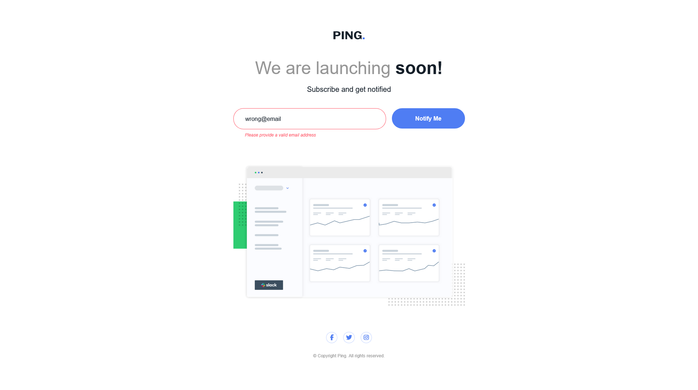

# Frontend Mentor - Ping coming soon page solution

This is a solution to the [Ping coming soon page challenge on Frontend Mentor](https://www.frontendmentor.io/challenges/ping-single-column-coming-soon-page-5cadd051fec04111f7b848da). Frontend Mentor challenges help you improve your coding skills by building realistic projects. 

## Table of contents

- [Overview](#overview)
  - [The challenge](#the-challenge)
  - [Screenshot](#screenshot)
  - [Links](#links)
  - [Built with](#built-with)
  - [What I learned](#what-i-learned)
  - [Continued development](#continued-development)
  - [Useful resources](#useful-resources)
- [Author](#author)

## Overview

This is a small website where you can practice handling of forms and providing error feedbacks based on user input. It has one form control element so it is a good start for a form handling practice.

### The challenge

Users should be able to:

- View the optimal layout for the site depending on their device's screen size
- See hover states for all interactive elements on the page
- Submit their email address using an `input` field
- Receive an error message when the `form` is submitted if:
	- The `input` field is empty. The message for this error should say *"Whoops! It looks like you forgot to add your email"*
	- The email address is not formatted correctly (i.e. a correct email address should have this structure: `name@host.tld`). The message for this error should say *"Please provide a valid email address"*

### Screenshot

Default:


Success:


Error:


### Links

- Solution URL: [https://www.frontendmentor.io/solutions/responsive-ping-coming-soon-page-with-simple-form-validation-Fs7hacI0pP](https://www.frontendmentor.io/solutions/responsive-ping-coming-soon-page-with-simple-form-validation-Fs7hacI0pP)
- Live Site URL: [https://schindlerdumagat.github.io/ping-coming-soon-page/](https://schindlerdumagat.github.io/ping-coming-soon-page/)

### Built with

- Semantic HTML5 markup
- CSS custom properties
- Flexbox
- CSS Grid
- Mobile-first workflow
- JavaScript
- [BEM](https://getbem.com/) - Block, Element, Modifier

### What I learned

I was able to validate forms upon submit.
```js
form.addEventListener('submit', (e) => {
    e.preventDefault();

    // Extracting data from form
    const formData = new FormData(e.target);
    const { email } = Object.fromEntries(formData.entries());

    form.classList.remove("form--error");
    form.classList.remove("form--success");

    const emailError = validateEmail(email);

    if (emailError) {

        // To do if email is invalid
        form.classList.add("form--error");
        emailFeedback.textContent = emailError;
    } else {

        // To do if email is valid
        form.classList.add("form--success");
        emailFeedback.textContent = "Email is submitted";
    }
})

// Checks email input errors
function validateEmail(email) {

    let emailError = "";

    if (email.length === 0) {
        emailError = "Whoops! It looks like you forgot to add your email";
    } else if (!validEmailRegex.test(email)) {
        emailError = "Please provide a valid email address";
    }

    return emailError;
}
```

### Useful resources

- [Client Side Form Validation](https://developer.mozilla.org/en-US/docs/Learn_web_development/Extensions/Forms/Form_validation) - This gave me the basics of form handling on the client side.

## Author

- Website - [Schindler Dumagat](https://schindlerdumagat.github.io/webportfolio/)
- Frontend Mentor - [@schindlerdumagat](https://www.frontendmentor.io/profile/schindlerdumagat)
- LinkedIn - [@schindler-dumagat-015238230](https://www.linkedin.com/in/schindler-dumagat-015238230/)
